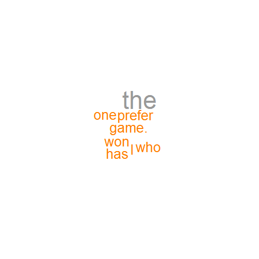

## Introduction of Words Plotter Application

<h4>(1) application is created with the shiny package,so it is a shiny app.</h4>
<br/>
<h4>(2)The main function of the app is to transfer the inputed text in a plot,
in which the words' labels are arranged according to the related words'
frequency.The higher the frequncy,the bigger the words' font.</h4>
<br/>
If you want to try the app and create the plot of your own text,visit the URL below:
https://kingstorm.shinyapps.io/dataProduct

During the coding, I have used 3 packages,they are shiny,RColorBrewer,wordcloud

pakcages introduction:

1.RColorBrewer:It Creates nice looking color palettes especially for thematic maps

2.wordcloud:It creates the plot of a word cloud relating to the words' frequency

3.shinyWell:It makes it incredibly easy to build interactive web applications with R

--- 

## details in coding 1
The 1st step to count the frequency of words is words segmentation.
Here I have coded a very basic function for words segmentation.

```r
#load the packages
library(shiny)
library(RColorBrewer)
library(wordcloud)
simpleSegmentation <- function(text){
  return(unlist(strsplit(text,"[ ]+")))
}
```
Here is the example.

```r
str <- "Today, I want to go to eat dinner."
simpleSegmentation(str)
```

```
## [1] "Today,"  "I"       "want"    "to"      "go"      "to"      "eat"    
## [8] "dinner."
```

---

## details in coding 2
Then, we are going to calculate the frequncy and here is my function to realise it.

```r
wordsFrequency <- function(text){
  str <- simpleSegmentation(text)
  sTable <- table(str)
  words <- names(sTable)
  freq <- as.numeric(sTable)
  wordsFreq <- data.frame(words = words,freq = freq)
  return(wordsFreq)
}
```
Here is the example.

```r
str <- "I I I LOVE LOVE LOVE"
wordsFrequency(str)
```

```
##   words freq
## 1     I    3
## 2  LOVE    3
```

---

## details in coding 3
At this point, we are going to plot the words, here is my function to plot the cloud word.

```r
wordsPlot <- function(text){
    wordsFreq <- wordsFrequency(text)
    #create the set of the colours
    rc=brewer.pal(9,"Set1") 
    #create the plot of the word cloud
    wordcloud(wordsFreq$words,wordsFreq$fre,scale=c(4,0.5),min.freq=-Inf,max.words=Inf,colors=rc)
}
```

---

## details in coding 4
Here is the example.

```r
str <- "I prefer the one who has won the game."
wordsPlot(str)
```

 
